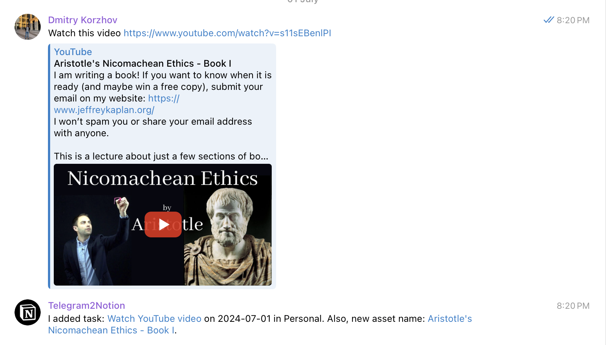

# Telegram to Notion Integration

This is a simple Telegram bot that integrates with the Notion API to create new pages in a Notion database based on the messages in a Telegram channel.

It can create 2 type of entities; 
- Tasks based on categories
- Task with assets (in my case it is education)



## Set up a project:

### Add env
```bash 
TELEGRAM_TOKEN = 
NOTION_TOKEN = 
NOTION_DATABASE_ID = 
ALLOWED_USERS = 
OPENAI_API_KEY =
NOTION_DATABASE_ID_ASSETS = 
```

### Run the project
```bash
python bot.py
```

You probably need to use `ngrok` to expose the local server to the itnerneter to be able test locally telegram integration.

```bash
ngrok http 8000
```